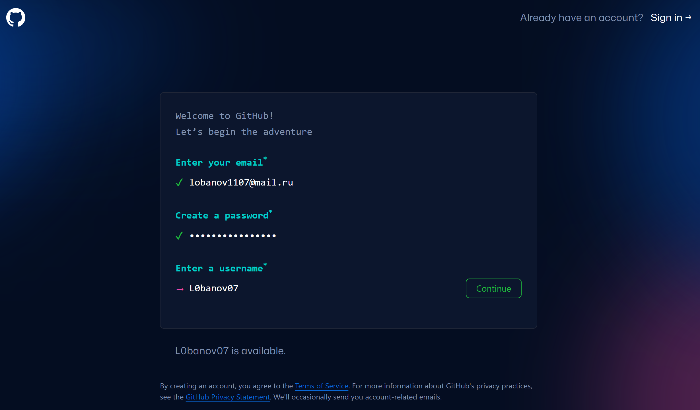
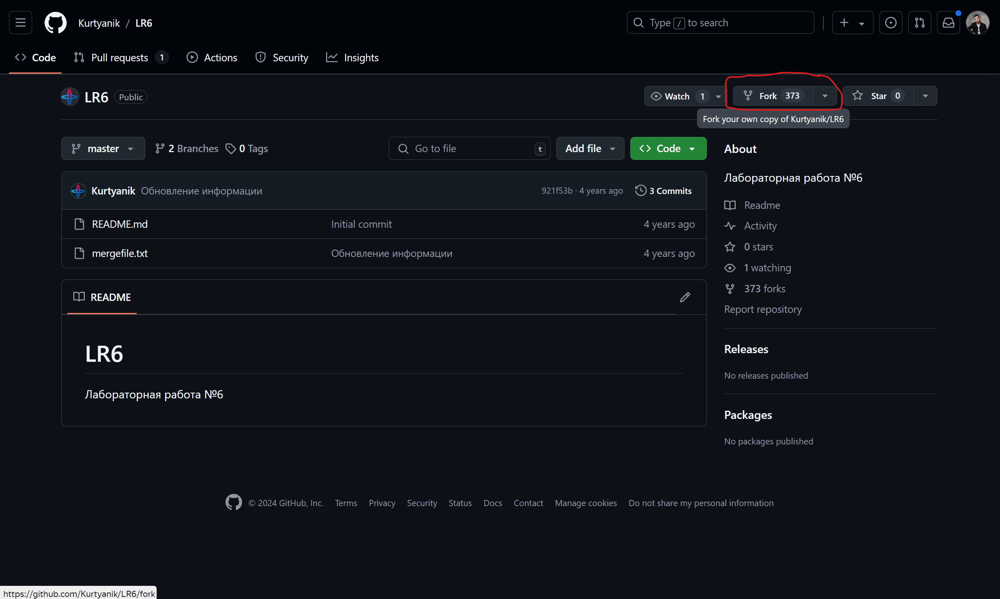
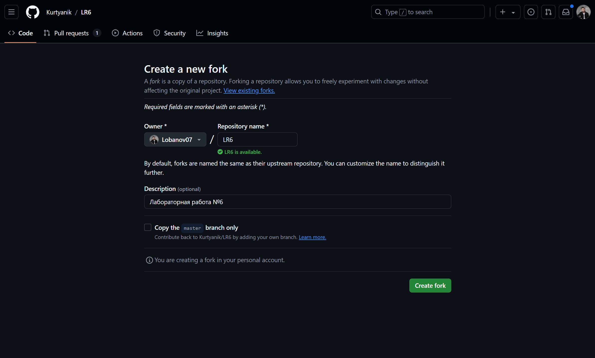
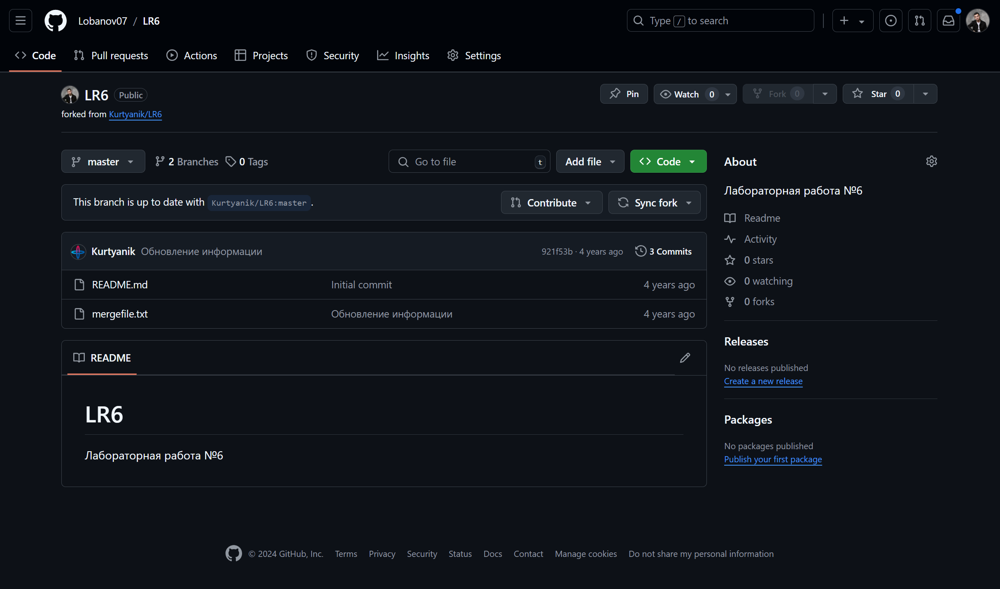
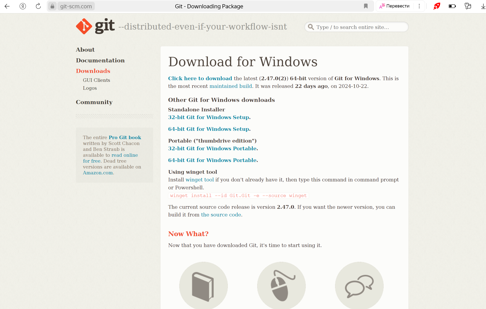
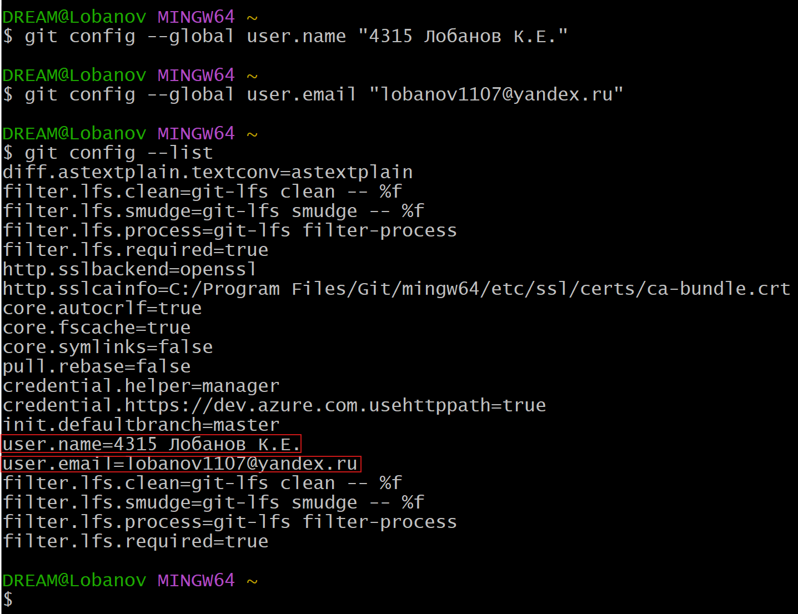
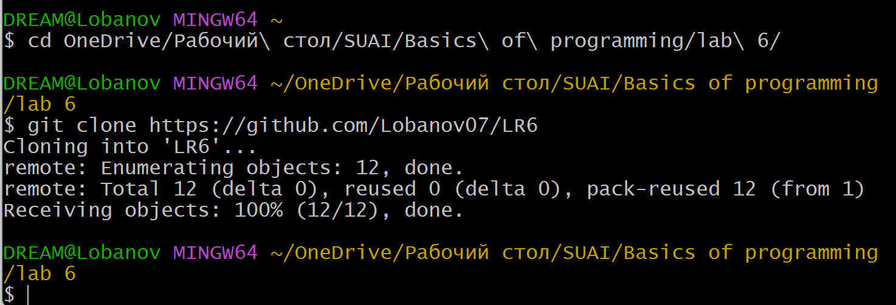
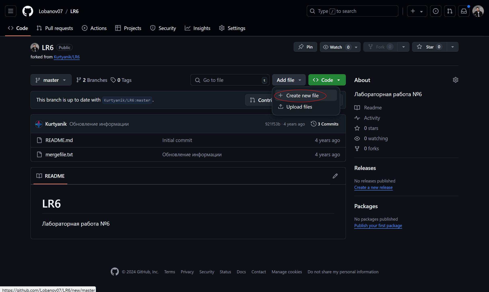
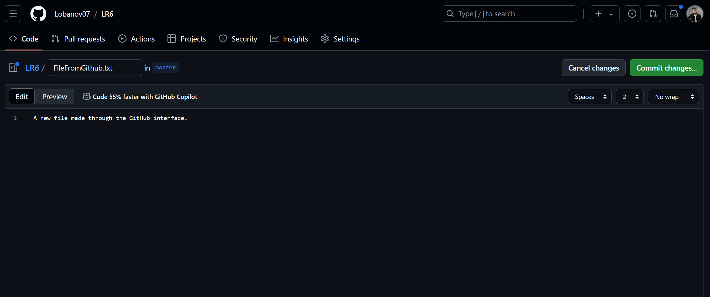
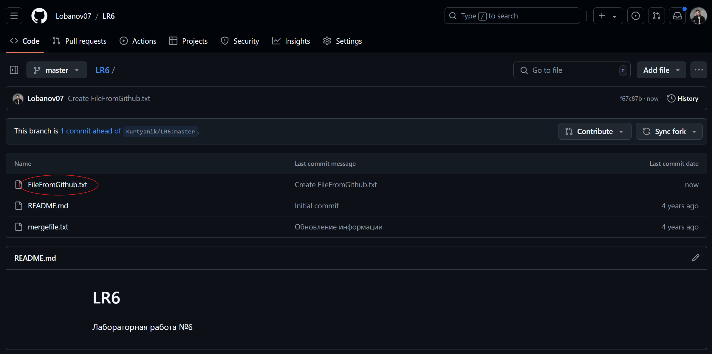

# Лабораторная работа №6. Система контроля версий
## Содержание

1. [Цель работы](#Цель-Работы)
2. [Порядок выполнения работы](#Порядок-выполнения-работы)
3. [Ход выполнения работы](#Ход-выполнения-работы)
4. [Лог команд](#Лог-команд)
5. [История операций в форматированном виде](#История-операций-вформатированном-виде)
6. [Выводы](#Выводы)


## Цель работы 
Изучение базовых возможностей системы управления версиями, опыт работы с Git Api, опыт работы с локальным и удаленным репозиторием. 

## Порядок выполнения работы
1. Создать аккаунт на сайте GitHub;
2. Сделать копию в личное хранилище из https://github.com/Kurtyanik/LR6/ (Fork);  
3. Установить Git;
4. Настроить клиент git, введя имя пользователя (Группа Фамилия И.О.) и email;
5. Клонировать свой личный удалённый репозиторий на компьютер;
6. Добавить файл через интерфейс GitHub. Подтянуть изменения в локальный репозиторий;
7. Получить историю операций для каждой из веток;
8. Получить историю операций для каждой из веток;
9. Выполнить слияние в ветку master, разрешив конфликт;
10. Удалить побочную ветку после успешного слияния;
11. Сделать изменения и зафиксировать их, оставляя комментарии, несколько раз;
12. Сделать откат коммита;
13. Создать ветку для отчёта;
14. Начать оформлять отчёт в файле README.md, используя markdown синтаксис;
    - В отчёте должен быть снимки экрана консоли и сторонних программ. Файлы снимков экрана разместить в отдельной папке.
    - Лог команд (без результатов их выполнения).
15. Получить историю операций в форматированном виде (сокращённый хэш + дата + имя автора + комментарий);
16. Отправить локальные изменения в сетевое хранилище GitHub.

## Ход выполнения работы
### 1. Создание аккаунта на сайте GitHub
Чтобы создать аккаунт на сайте GitHub, необходимо перейти на эту страницу: https://github.com/signup — и заполнить форму (рис. 1).
<p align="center"></p>
<p align="center">Рисунок 1 - Регистрация аккаунта на GitHub</p></br>

### 2. Копирование в личное хранилище из https://github.com/Kurtyanik/LR6/ (Fork)
Чтобы скопировать репозиторий преподавателя, необходимо в него перейти (рис. 2). Затем нужно указать парметры копирования (рис. 3) и создать копию (fork).
<p align="center"></p>
<p align="center">Рисунок 2 - Переход в репозиторий преподаватлея</p></br>

<p align="center"></p>
<p align="center">Рисунок 3 - Создание копии (Fork)</p></br>
Скопированный репозиторий представлен на рисунке 4.
<p align="center"></p>
<p align="center">Рисунок 4 - Созданный репозиторий</p></br>

### 3. Установка Git
Чтобы установить Git, необходимо перейти на страницу https://git-scm.com/downloads (рис. 5), выбрать нужную версию Git и скачать её.
<p align="center"></p>
<p align="center">Рисунок 5 - Установка Git</p></br>

### 4. Настройка клиента git, ввод имя пользователя (Группа Фамилия И.О.) и email
Чтобы указать имя пользователя и email в клинте git, необходимо воспользоваться командами:
```
git config --global user.name "(username)"
git config --global user.email "(email)"
```
Чтобы посмотреть полный список параметров клиента git (рис. 6) нужно воспользоваться командой:
```
git config --list
```
<p align="center"></p>
<p align="center">Рисунок 6 - Настройка клиента git</p></br>

### 5. Клонирование своего личного удалённого репозитория на компьютер
Для клонирование своего личного удалённого репозитория на компьютер сначала нужно перейти в папку, где должен храниться репозиторий. Перейти в необходимую папку можно с помощью команды:
```
cd (путь)
```
Когда нужная папка достигнута, можно клонировать удалённый репозиторий на свой компьютер (рис. 7) с помощью команды:
```
git clone (ссылка на удалённый репозиторий)
```
<p align="center"></p>
<p align="center">Рисунок 7 - Клонирование репозитория на компьютер</p></br>

### 6. Добавление файла через интерфейс GitHub. Подтягивание изменения в локальный репозиторий
Чтобы добавить файл через интерфейс GitHub, нужно нажать на кнопку "Add file", затем "Create new file" (рис. 8). 
<p align="center"></p>
<p align="center">Рисунок 8 - Открытие интрефейса для создания файла</p></br>

Следующим шагом необходимо написать название файла и его содержимое (рис. 10).
<p align="center"></p>
<p align="center">Рисунок 9 - Создание файла</p></br>

После подтверждения изменений, созданный файл (рис. 10) появится в репозитории.
<p align="center"></p>
<p align="center">Рисунок 10 - Созданный файл</p></br>

Чтобы подтянуть изменеия в локальный репозиторий (рис. 11), необходимо в него перейти и воспользоваться командой:
```
git pull
```
<p align="center"></p>
<p align="center">Рисунок 11 - Подтягивание изменений в локальный репозиторий</p></br>
