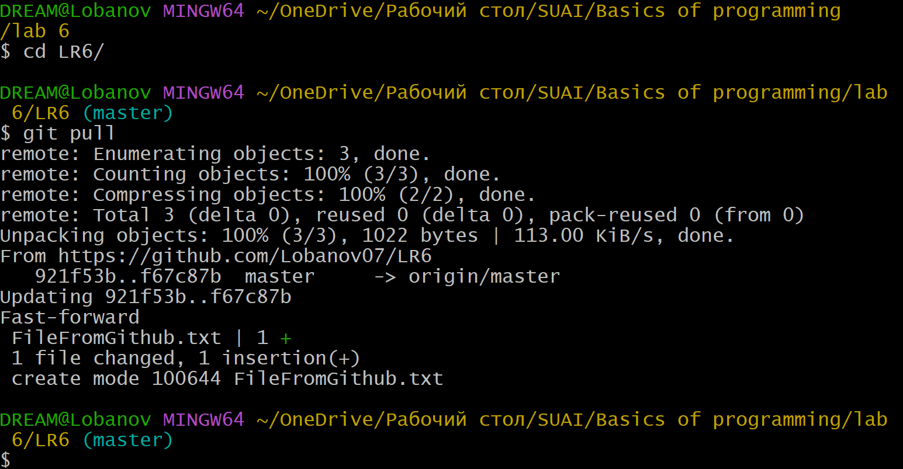
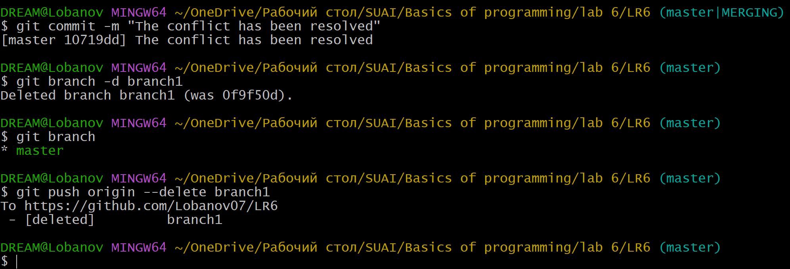

# Лабораторная работа №6. Система контроля версий
## Содержание

1. [Цель работы](#Цель-Работы)
2. [Порядок выполнения работы](#Порядок-выполнения-работы)
3. [Ход выполнения работы](#Ход-выполнения-работы)
4. [Лог команд](#Лог-команд)
5. [История операций в форматированном виде](#История-операций-вформатированном-виде)
6. [Выводы](#Выводы)


## Цель работы 
Изучение базовых возможностей системы управления версиями, опыт работы с Git Api, опыт работы с локальным и удаленным репозиторием. 

## Порядок выполнения работы
1. Создать аккаунт на сайте GitHub;
2. Сделать копию в личное хранилище из https://github.com/Kurtyanik/LR6/ (Fork);  
3. Установить Git;
4. Настроить клиент git, введя имя пользователя (Группа Фамилия И.О.) и email;
5. Клонировать свой личный удалённый репозиторий на компьютер;
6. Добавить файл через интерфейс GitHub. Подтянуть изменения в локальный репозиторий;
7. Получить историю операций для каждой из веток;
8. Просмотреть последние изменения;
9. Выполнить слияние в ветку master, разрешив конфликт;
10. Удалить побочную ветку после успешного слияния;
11. Сделать изменения и зафиксировать их, оставляя комментарии, несколько раз;
12. Сделать откат коммита;
13. Создать ветку для отчёта;
14. Начать оформлять отчёт в файле README.md, используя markdown синтаксис;
    - В отчёте должен быть снимки экрана консоли и сторонних программ. Файлы снимков экрана разместить в отдельной папке.
    - Лог команд (без результатов их выполнения).
15. Получить историю операций в форматированном виде (сокращённый хэш + дата + имя автора + комментарий);
16. Отправить локальные изменения в сетевое хранилище GitHub.

## Ход выполнения работы
### 1. Создание аккаунта на сайте GitHub
Чтобы создать аккаунт на сайте GitHub, необходимо перейти на эту страницу: https://github.com/signup — и заполнить форму (рис. 1).
<p align="center"></p>
<p align="center">Рисунок 1 - Регистрация аккаунта на GitHub</p>

### 2. Копирование в личное хранилище из https://github.com/Kurtyanik/LR6/ (Fork)
Чтобы скопировать репозиторий преподавателя, необходимо в него перейти (рис. 2). Затем нужно указать парметры копирования (рис. 3) и создать копию (fork).
<p align="center"></p>
<p align="center">Рисунок 2 - Переход в репозиторий преподаватлея</p>

<p align="center"></p>
<p align="center">Рисунок 3 - Создание копии (Fork)</p>
Скопированный репозиторий представлен на рисунке 4.
<p align="center"></p>
<p align="center">Рисунок 4 - Созданный репозиторий</p>

### 3. Установка Git
Чтобы установить Git, необходимо перейти на страницу https://git-scm.com/downloads (рис. 5), выбрать нужную версию Git и скачать её.
<p align="center"></p>
<p align="center">Рисунок 5 - Установка Git</p>

### 4. Настройка клиента git, ввод имя пользователя (Группа Фамилия И.О.) и email
Чтобы указать имя пользователя и email в клинте git, необходимо воспользоваться командами:
```
git config --global user.name "(username)"
git config --global user.email "(email)"
```
Чтобы посмотреть полный список параметров клиента git (рис. 6) нужно воспользоваться командой:
```
git config --list
```
<p align="center"></p>
<p align="center">Рисунок 6 - Настройка клиента git</p>

### 5. Клонирование своего личного удалённого репозитория на компьютер
Для клонирование своего личного удалённого репозитория на компьютер сначала нужно перейти в папку, где должен храниться репозиторий. Перейти в необходимую папку можно с помощью команды:
```
cd (путь)
```
Когда нужная папка достигнута, можно клонировать удалённый репозиторий на свой компьютер (рис. 7) с помощью команды:
```
git clone (ссылка на удалённый репозиторий)
```
<p align="center"></p>
<p align="center">Рисунок 7 - Клонирование репозитория на компьютер</p>

### 6. Добавление файла через интерфейс GitHub. Подтягивание изменения в локальный репозиторий
Чтобы добавить файл через интерфейс GitHub, нужно нажать на кнопку "Add file", затем "Create new file" (рис. 8). 
<p align="center"></p>
<p align="center">Рисунок 8 - Открытие интрефейса для создания файла</p>

Следующим шагом необходимо написать название файла и его содержимое (рис. 10).
<p align="center"></p>
<p align="center">Рисунок 9 - Создание файла</p>

После подтверждения изменений, созданный файл (рис. 10) появится в репозитории.
<p align="center"></p>
<p align="center">Рисунок 10 - Созданный файл</p>

Чтобы подтянуть изменеия в локальный репозиторий (рис. 11), необходимо в него перейти и воспользоваться командой:
```
git pull
```
<p align="center"></p>
<p align="center">Рисунок 11 - Подтягивание изменений в локальный репозиторий</p>

### 7. Получение истории операций для каждой из веток
Чтобы получить историю операций для каждой ветки, необходимо на каждой ветки выполнить команду:
```
git log (Название ветки)
```
Так как сейчас активно ветка "master" при выполнении команды `git log master` в консоль выводится история операция для ветки master (рис. 12).

<p align="center"></p>
<p align="center">Рисунок 12 - История операций ветки master</p>

Чтобы перейти на другую ветку можно воспользоваться командой:
``` 
git checkout (название ветки)
```
После перехода на ветку branch1 необходимо выполнить команду `git log branch1`, чтобы получить историю операций ветки branch1 (рис. 13).
<p align="center"></p>
<p align="center">Рисунок 13 - История операций ветки branch1</p>

### 8. Просмотр последних изменений
Чтобы просмотреть последние изменения, нужно на каждой ветки выполнить команду:
```
git show (Название ветки)
```
Так как сейчас активна ветка branch1, можно выполнять команду `git show branch1`. В результате получим последние изменения на ветке branch1 (рис. 14).

<p align="center"></p>
<p align="center">Рисунок 14 - Последние изменения ветки branch1</p>

Следующим шагом необходимо переключить ветку branch1 на master. Затем необходимо выполнить команду `git show master`, чтобы получить последние изменения ветки mastert (рис. 15).

<p align="center"></p>
<p align="center">Рисунок 15 - Последние изменения ветки master</p>

### 9. Выполнение слияния в ветку master, разрешив конфликт
Чтобы слить две ветки нужно перейти на ветку в которую нужно слить вторую ветку и воспользоваться командой:
```
git merge (Название второй ветки)
```
При попытке слить в ветку master ветку branch1 возникает конфликт (рис. 16).
<p align="center"></p>
<p align="center">Рисунок 16 - Появление конфликта при слияние</p>

Чтобы посмотреть в консоли в чём заключается конфликт (рис. 17), можно воспользоваться командой:
```
git diff
```
<p align="center"></p>
<p align="center">Рисунок 17 - Конфликт в консоли</p>

Чтобы разрешить конфликт можно использовать специальные редакторы или графический интерфейс git. Для разрешения данного конфликта был использован редактор Notepad++ (рис. 18-19).
<p align="center"></p>
<p align="center">Рисунок 18 - Просмотр конфликта в Notepad++</p>

<p align="center"></p>
<p align="center">Рисунок 19 - Разрешение конфликта</p>

После того как конфликт разрешён, полученный файл необходимо зафиксировать. Для этого сначала добавляем его в индекс с помощью команды:
```
git add (Название файла)
```
Затем проверям, что он добавился в индекс с поомщью команды:
```
git status
```
И последним шагом фиксируем изменения, чтобы завершить слияние (рис. 20) с помощью команды:
```
git commit -m "(Комментарий)"
```
<p align="center"></p>
<p align="center">Рисунок 20 - Завершение слияния веток</p>

### 10. Удаление побочной ветки после успешного слияния
После успешного слияния ветка branch1 больше не нужна и её нужно удалить (рис. 21). 

Сначала её нужно удалить локально с поомщью команды:
```
git branch -d (Название ветки)
```
Затем её нужно удалить из удалённого репозитория с помощью команды:
```
git push origin --delete branch1
```
<p align="center"></p>
<p align="center">Рисунок 21 - Удаление ветки branch1</p>

### 11 Создание изменений и их фиксация, оставляя комментарии, несколько раз;
Чтобы создать изменения в уже существующем файле можно воспользоваться командой:
```
echo "Новый текст файла" > (Название файла)
```
Содержимое файла "FileFromGitHub.txt" было изменено 2 раза. Оба раза сопровождались фиксацией изменний с комменатриями (рис. 22 - 23)
<p align="center"></p>
<p align="center">Рисунок 22 - Первое изменение</p>

<p align="center"></p>
<p align="center">Рисунок 23 - Второе изменение</p>

### 12. Создание отката коммита
Перед откатом коммита необходимо проверить историю коммитов (рис. 24), чтобы после отката можно было убедиться, что всё прошло успешно. Проверить историю можно с помощью команды:
```
git log
```
<p align="center"></p>
<p align="center">Рисунок 24 - Проверка истории коммитов</p>

Для откада последнего коммита необходимо воспользоваться командой:
```
git reset HEAD~1
```
После отката последнего коммита ещё раз была использвана команда `git log`. До отката последний коммит был "The second change has been created", а после стал "The first change has been created", значит откат прошёл успешно (рис. 25).
<p align="center"></p>
<p align="center">Рисунок 25 - Откат последнего коммита</p>

### 13. Создать ветку для отчёта
Для создания ветки для отчёта (рис. 26) необходимо воспользоваться командой:
```
git branch (Название новой ветки)
```
А чтобы посмотреть какие существуют ветки, можно воспользоватсья командой:
```
git branch
```
<p align="center"></p>
<p align="center">Рисунок 26 - Создание ветки для отчёта</p>
Чтобы передать все изменения в ветке master в удалённый репозиторий, необходимо воспользоватсья командой:
```
git push
```
Чтобы недавно созданная локальная ветка report появилась в удалённом репозитории (рис. 27), нужно воспользоваться командой:

```
git push origin report
```

<p align="center"></p>
<p align="center">Рисунок 27 - Отправка изменений в удалённый репозиторий</p>

### 14. Начало оформления отчёта в файле README.md
Для удобного форматирования файла README.md был выбран редактор кода VS Code.
<p align="center"></p>
<p align="center">Рисунок 28 - Написание отчёта в файле README.md</p>


### 15. Получение истории операций в форматированном виде
Чтобы получить историю операций в форматированном виде (рис. 29) (сокращённый
хэш + дата + имя автора + комментарий), необходимо воспользоваться командой:
```
git log --date=format:'%D' --pretty=format:"%h -> %cd, %cn ( %s )"
```

<p align="center"></p>
<p align="center">Рисунок 29 - Написание отчёта в файле README.md</p>

### 16. Отправка локальных изменений в сетевое хранилище GitHub
Чтобы отправить локальные изменения в сетевое хранилище GitHub после завершения написания отчёта нужно воспользоваться командой: 
```
git push
```
После чего все локальные изменения ветки report появятся в удалённом репозитории

## Лог команд
<p>git config --global user.name "4315 Лобанов К.Е."
<p>git config --global user.email "lobanov1107@yandex.ru"
<p>git config --list
cd OneDrive/Рабочий\ стол/SUAI/Basics\ of\ programming/lab\ 6/
<p>git clone https://github.com/Lobanov07/LR6
cd LR6/
<p>git pull
<p>git log master
<p>git log branch1
<p>git checkout branch1
<p>git log branch1
<p>git show branch1
<p>git checkout master
<p>git show master
<p>git merge branch1
<p>git diff
<p>git add mergefile.txt
<p>git status
<p>git commit -m "The conflict has been resolved"
<p>git branch -d branch1
<p>git branch
<p>git push origin --delete branch1
echo "The first change in the file" > FileFromGithub.txt
<p>git status
<p>git add FileFromGithub.txt
<p>git commit -m "The first change has been created"
<p>echo "The second change in the file" > FileFromGithub.txt
<p>git status
<p>git add FileFromGithub.txt
<p>git commit -m "The second change has been created"
<p>git log
<p>git reset HEAD~1
<p>git log
<p>git branch report
<p>git branch
<p>git push
<p>git push origin report
<p>git checkout report
<p>git add .
<p>git status
<p>git commit -m "Starting to write a report and adding a folder of screenshots"
<p>git status
<p>git add .
<p>git commit -m "The first 6 points of the report have been written"
<p>git log --date=format: '%D' --pretty=format: "%h -> %cd, %cn ( %s )"

## История операций в форматированном виде

<p>b032a7c -> 11/13/24, 4315 Лобанов К.Е. ( The first 6 points of the report have been written )
<p>c7d4c38 -> 11/13/24, 4315 Лобанов К.Е. ( Starting to write a report and adding a folder of screenshots )
<p>29792d4 -> 11/13/24, 4315 Лобанов К.Е. ( The first change has been created )
<p>10719dd -> 11/13/24, 4315 Лобанов К.Е. ( The conflict has been resolved )
<p>f67c87b -> 11/13/24, GitHub ( Create FileFromGithub.txt )
<p>921f53b -> 11/21/20, GitHub ( Обновление информации )
<p>0f9f50d -> 11/21/20, GitHub ( Заполнил файл )
<p>c08a654 -> 11/21/20, GitHub ( Файл создан пустым )
<p>3c6e913 -> 11/21/20, GitHub ( Initial commit )

## Выводы
В ходе лабораторной работы были изучены базовые возможности системы управления версиями. Получен опыт работы с Git Api, опыт работы с локальным и удаленным репозиторием. 

Была изучена система контроля версий Git и её интеграция с платформой GitHub. Получен практический опыт в использовании основных функций Git, таких как создание и клонирование репозиториев, работа с ветками, разрешение конфликтов, а также ведение истории изменений.